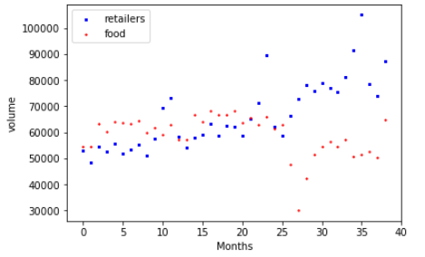
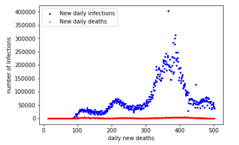
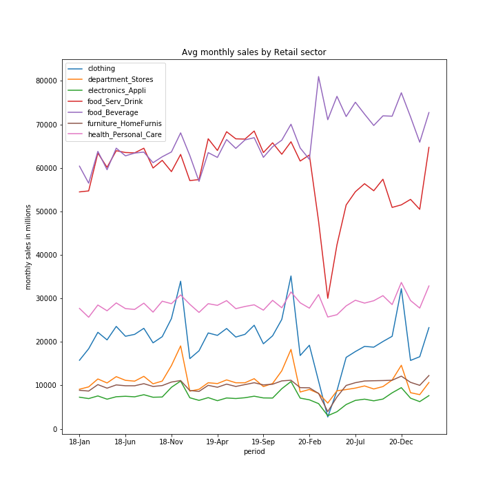
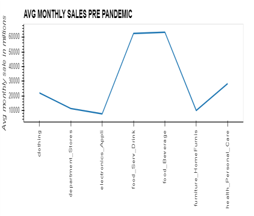
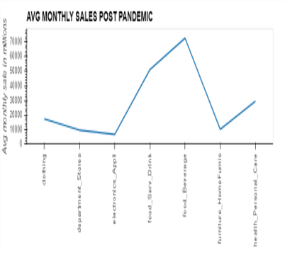
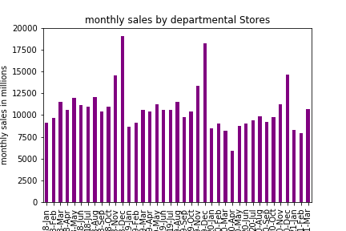
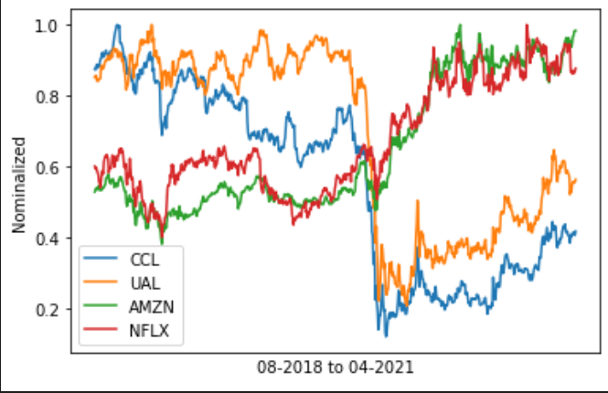
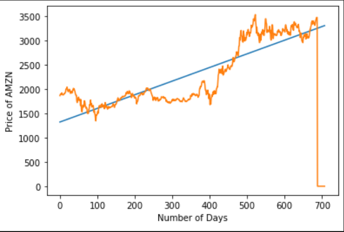

# pandemic_pandas
FinTech Project 1

# Data

Data Pulled from following

Census [census's Website](https://www.census.gov/econ/currentdata/dbsearch?program=MARTS&startYear=2018&endYear=2021&categories%5B%5D=4451&dataType=SM&geoLevel=US&adjusted=1&notAdjusted=1&submit=GET+DATA&releaseScheduleId=)

Alpaca [Alpaca's Website](https://alpaca.markets/)

WHO [Who's Website](https://www.who.int/)

### Data cleaning process
Clean the data, dropped null, rename columns and read clean data to an output file.

# Analysis

## Pandemic analysis
* Since Covid-19 reached our shores, it has had an impact on all facets of life. The Pandemic Pandas decided to analyze the impacts to the retail sector and more specifically the food service industry and brick and mortar department stores

## Our hypothesis:
* The pandemic had a negative impact on stock data and overall company evaluation numbers. Below are charts that will introduce you to our analysis

First chart showing the overall food and retail store sales volumes from January 2018 until March 2021

New deaths in the US from Jan 2020 unit May 2021

## Results

* Based on the data number of daily infection and daily death rate are in correlation with the sales volumeOf the food and retail sector. 

* Once the Pandemic arrived you see the precipitous drop in the food and service industry vs the Retail sector which indicates a significant impact of the increase in infection rates to the food and service industry.

## Process

* Data was pull from census.gov and separated to pre and post pandemic timeframe from the following retail sector, 
Department stores, electronics and appliances, food service and drink, food and beverage, furniture and home furnishing ,health and personal care  

* Retail data was separated into pre and post pandemic timeframe.

* Analysis were performed on the data, by calculating the mean , standard deviation and also sales correlation.

The below plot show the average sales over a 3 years period

The below plot show the change in sales during pre and post pandemic.

Average monthly pre pandemic sales plot

Average monthly post pandemic sales plot

## Result
* Base on the above plot we could see that pandemic affected sale in every sector of retail
We can infer that at the height of pandemic which is march 2020 to April 2020 every area of retail took a hit due to lock down and restriction.
* We can also see that as the retail sector start to pivot to online, sales gradually starts to increase. 

* During the analysis of the pre and post pandemic we could also see that section that have strong positive correlated remain the same and correlation change with sectors that are not correlated prior to pandemic.

Stock Price Daily plotted between August of 2018 and April of2021. Did these stocks go up or down?

The blue line represents the linear regression and the Trajectory of the Stock price.The trajectory of online essentials and businesses that pivoted to online will continue to grow

